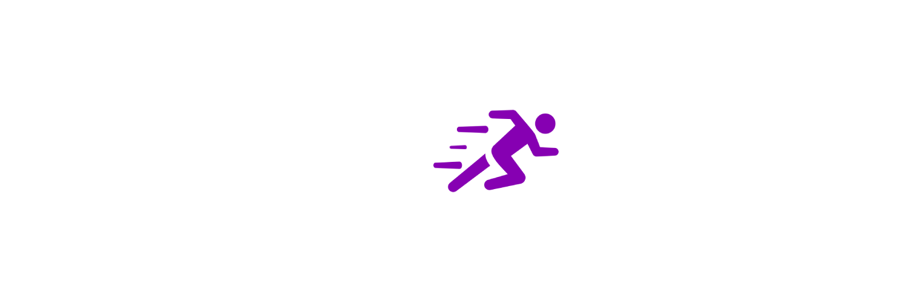

# ExpediteSERF

ExpediteSERF is a comprehensive cybersecurity scanning workflow that automates the execution of various security checks, including SCAP Compliance Checker scans, comparisons, baseline captures, and port scans. This tool is designed to streamline the process of identifying and addressing security vulnerabilities in your systems.



## Features

- **SCC Scan**: Runs the SCAP Compliance Checker scan.
- **SCC Compare**: Compares the results of the last two SCAP Compliance Checker scans.
- **SERF Capture**: Captures the current baseline of installed patches, programs, groups, services, and local accounts.
- **Baseline Compare**: Compares the current system state against the captured baseline.
- **Port Scan**: Runs an intense Nmap port scan on the local machine.

## Prerequisites

- PowerShell 7
- SCAP Compliance Checker 5.7.1
- Nmap

## Directory Structure

```
ExpediteSERF/
├── config.ini
├── ExpediteSERF.bat
├── Modules/
│   ├── SCC_Compare.ps1
│   ├── SCC_Scan.ps1
│   ├── SERFCaptureBaseline.ps1
│   ├── Baseline_Compare.ps1
│   ├── Port_Scan.ps1
│   ├── CVE_Finder.ps1
│   ├── ScriptResults/
│   └── Logs/
└── assets/
    └── expediteserf.png
```

## Configuration

Edit the `config.ini` file to specify the paths for the SCAP Compliance Checker and the module scripts. Ensure the paths are correct for your environment.

```ini
; Paths for SCAP Compliance Checker
OPTIONS_FILE_PATH=C:\\Program Files\\SCAP Compliance Checker 5.7.1\\options.xml
SESSION_FOLDER_PATH=C:\\Users\\Administrator\\SCC\\Sessions
SCC_SCANNER_PATH=C:\\Program Files\\SCAP Compliance Checker 5.7.1\\cscc.exe

; Paths for Module Scripts
SCC_COMPARE_PATH=Modules\\SCC_Compare.ps1
SERF_CAPTURE_PATH=Modules\\SERFCaptureBaseline.ps1
BASELINE_COMPARE_PATH=Modules\\Baseline_Compare.ps1
PORT_SCAN_PATH=Modules\\Port_Scan.ps1
SCC_SCAN_PATH=Modules\\SCC_Scan.ps1
```

## Usage

Run the `ExpediteSERF.bat` script with the desired options. If no options are provided, the full workflow will be executed by default.

### Options

- `-s` : Run SCC Scan only.
- `-c` : Run SCC Compare only.
- `-b` : Run SERF Capture only.
- `-d` : Run Baseline Compare only.
- `-n` : Run Port Scan only.
- `-h` : Display detailed help and usage information.

### Examples

Run the full workflow:

```sh
ExpediteSERF.bat
```

Run SCC Scan and SCC Compare only:

```sh
ExpediteSERF.bat -s -c
```

Display help:

```sh
ExpediteSERF.bat -h
```

## Typical Workflow

1. **Pre-Installation Steps**: Before installing any new software, perform any pre-installation steps required by your organization. This may include running a threat scan with your antivirus software to ensure the system is clean.

2. **Run Baseline Capture**: Before installing any new software, run the SERF Capture module to capture the current baseline of your system. This will create a snapshot of installed patches, programs, groups, services, and local accounts.
    ```sh
    ExpediteSERF.bat -b
    ```

3. **Install Software**: Install the new software or program as required.

4. **Run ExpediteSERF**: After installation, run the ExpediteSERF workflow to perform various security checks and comparisons.
    ```sh
    ExpediteSERF.bat
    ```

5. **Review Results**: Review the logs and reports generated by ExpediteSERF to identify any security vulnerabilities or changes to the system state.

## Logging

Logs for each module are stored in the `Modules/Logs` directory. Each module creates its own log file to capture execution details and any errors encountered.

## Contributing

Contributions are welcome! Please fork the repository and submit a pull request with your changes.

## License

This project is licensed under the GNU General Public License v3.0. See the [LICENSE](LICENSE) file for details.

## Contact

For any questions or issues, please contact Alejandro Rengifo at [your-email@example.com].

## Acknowledgements

- Jason Wheeler for the initial version of the SERF Capture script.
- The open-source community for their invaluable contributions.
